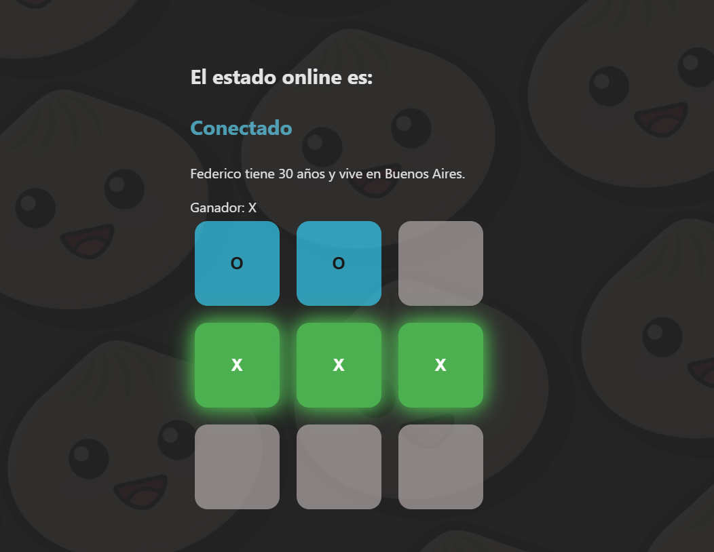

# ❌⭕ Tres en Raya (Tic-Tac-Toe) - React + Bun

¡Bienvenido! Este es un proyecto de prueba donde implemento el clásico juego **Tres en Raya** utilizando tecnologías modernas del ecosistema React.

> **Propósito:** Aprender, crear y programar. Este proyecto busca consolidar conocimientos en lógica de programación, manejo de estado en React y el uso del runtime Bun.

## 📸 Galería del Proyecto

Así es como luce la aplicación actualmente:



*(Si tienes más fotos, puedes agregarlas aquí abajo siguiendo el mismo formato)*
## 🚀 Características

* **Juego Completo:** Lógica de turnos (X vs O) y bloqueo al finalizar.
* **Feedback Visual:** Resaltado de la línea ganadora y status del juego.
* **Hooks Personalizados:**
    * `useOnline`: Detecta y muestra si el usuario tiene conexión a internet en tiempo real.
    * `useFetch`: Implementación base para consumo de APIs.
* **Tech Stack Moderno:** Creado con **Bun** para una experiencia de desarrollo rápida.

## 🛠 Tecnologías Utilizadas

* [React](https://react.dev/)
* [Bun](https://bun.sh/) (v1.3.9)
* [TypeScript](https://www.typescriptlang.org/)

## 📦 Instalación y Uso

Para probar este proyecto en tu máquina local:

1.  **Instalar dependencias:**
    ```bash
    bun install
    ```

2.  **Iniciar servidor de desarrollo:**
    ```bash
    bun dev
    ```

3.  **Compilar para producción:**
    ```bash
    bun start
    ```

## ✒️ Autor

* **Alan Mauricio Fernandez** - *Desarrollo y Lógica*

---
*Hecho con fines educativos.*